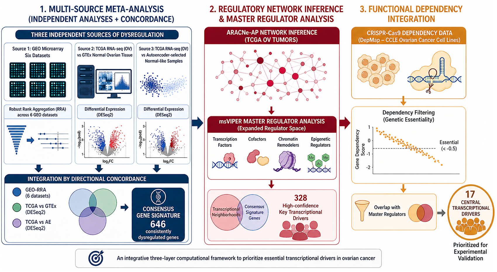

# Ovary Signatures — Reproducible transcriptomic analyses for a Briefings in Bioinformatics manuscript

This repository contains the **R analysis pipeline** supporting the manuscript:

> **Integrative Transcriptomics Addresses Control Ambiguity to Identify a Robust Ovarian Cancer Signature and Functionally Essential Driver Regulators**

The workflow integrates **multi-cohort transcriptomics**, **network-based Master Regulator Analysis (MRA)**, and **functional evidence from CRISPR dependency screens** to derive a robust ovarian cancer gene signature and a high-confidence set of upstream driver regulators.

## Graphical abstract


---

## Key Points

- A **multi-source meta-analytic framework** combining **GEO microarray studies**, **TCGA RNA-seq** data, and **two complementary normal control strategies** yields a **consensus ovarian cancer gene signature** that is robust to dataset-specific noise and **control selection bias**, addressing a key limitation of single-cohort transcriptomic analyses.
- Extending **Master Regulator Analysis** beyond canonical sequence-specific transcription factors to the broader class of **transcriptional modulators** (including **cofactors, chromatin remodelers, and epigenetic regulators**) systematically recovers upstream drivers that are invisible to expression-level filters and would be missed by TF-restricted analyses.
- Integrating **CRISPR-Cas9 dependency data** from the **Cancer Dependency Map (DepMap)** as an orthogonal functional layer provides a principled criterion to distinguish transcriptionally inferred regulators from those that are **genuinely required for tumor cell survival**, reducing the candidate list to a high-confidence set suitable for experimental prioritization.
- The fully documented **R pipeline** is designed for **modularity and reproducibility**, enabling direct application to other cancer types where matched normal tissue is scarce, with user-adjustable parameters at each analytical layer.
- The framework identified **17 central transcriptional modulators** in ovarian cancer that are both master regulators of essential gene programs and **functionally required** in cancer cell lines, including well-known therapeutic targets and several understudied candidates that represent novel hypotheses for mechanistic and preclinical investigation.

---

## Repository Status

This repository is under active development as analyses are curated for publication-quality reproducibility (scripts, parameters, outputs, and documentation).

If you use this work, please cite the associated manuscript (see **Citation** below).

---

## Overview of the Analysis Framework

At a high level, the pipeline follows these stages:

1. **Data acquisition & harmonization**
   - Download and curate **GEO microarray** ovarian cancer studies.
   - Obtain **TCGA RNA-seq** ovarian cancer expression and metadata.
   - Ensure consistent gene identifiers and comparable expression units where applicable.

2. **Control ambiguity handling (normal strategies)**
   - Evaluate two complementary normal-control definitions/strategies to reduce biases caused by control choice (a common limitation in ovarian cancer transcriptomics where matched normals can be scarce).

3. **Differential expression & meta-analysis**
   - Compute within-study differential expression for each cohort/control strategy.
   - Perform meta-analytic integration to obtain a **consensus differential signal**.
   - Derive a **robust ovarian cancer signature** consistent across cohorts and control strategies.

4. **Regulatory network inference / use of prior networks**
   - Build or import a gene regulatory network suitable for regulator–target enrichment testing.

5. **Master Regulator Analysis (MRA) for transcriptional modulators**
   - Perform enrichment-based MRA to identify **upstream regulators** driving the consensus signature.
   - Expand candidates beyond TFs to include **transcriptional modulators** (cofactors, chromatin remodelers, epigenetic regulators).

6. **Functional prioritization with DepMap**
   - Integrate CRISPR dependency evidence to prioritize regulators that are **essential for tumor cell fitness**.
   - Output a **high-confidence driver set** (reported as 17 central modulators in the manuscript).

---

## How to Use / Reproduce (Quick Start)

> **Note:** Commands and script names may vary depending on the current repository layout.  
> If you add/rename scripts, keep this section updated so the paper remains reproducible.

### 1) Clone the repository

```bash
git clone https://github.com/JoelRuiz26/Ovary_signatures.git
cd Ovary_signatures
```

### 2) Create an R environment

Recommended: use a project-local library with `renv`.

```r
# In R
install.packages("renv")
renv::init()
# If renv.lock exists:
# renv::restore()
```

If you do not use `renv`, install required packages manually (see **Dependencies**).

### 3) Run the pipeline

This project is designed to run as a sequence of modular steps (preprocessing → meta-analysis → MRA → DepMap integration).

Typical execution patterns:
- Run numbered scripts in order (e.g., `01_*.R`, `02_*.R`, …), or
- Use an orchestrator script (e.g., `run_all.R`), or
- Use per-module entry points.

If you maintain an entry-point script, document it here, for example:

```bash
Rscript run_all.R
```

---

## Project Structure (Recommended)

If your repository already follows a different structure, consider aligning to a predictable layout such as:

- `data/`
  - `raw/` (downloaded input data; typically ignored in git)
  - `processed/`
- `metadata/` (sample annotations, study tables, mappings)
- `scripts/` (R scripts; ideally numbered or modular)
- `R/` (reusable functions)
- `results/`
  - `figures/`
  - `tables/`
- `docs/` (extra documentation, notes)
- `renv/` + `renv.lock` (optional, for reproducible environments)

**Important:** Large raw datasets should not be committed. Prefer links + download scripts, or Git LFS if truly necessary.

---

## Inputs and Data Sources

This pipeline integrates multiple public resources, which may include:

- **GEO** (Gene Expression Omnibus): ovarian cancer microarray expression studies.
- **TCGA**: ovarian cancer RNA-seq expression and clinical metadata.
- **DepMap** (Cancer Dependency Map): CRISPR-Cas9 gene dependency scores for ovarian cancer (and related) cell lines.

To support full reproducibility, this repository should include:
- a table listing all included GEO accessions and inclusion criteria,
- exact TCGA data release/version used,
- DepMap release version/date and the specific files ingested.

---

## Outputs (Typical)

Depending on the configured steps, outputs may include:

- **Consensus ovarian cancer gene signature**
  - gene lists (up/down), effect sizes, FDR/q-values
- **Meta-analysis summaries**
  - per-study DE statistics, heterogeneity measures, sensitivity analyses
- **Master regulators / transcriptional modulators**
  - regulator ranking, enrichment scores, target programs, leading-edge genes
- **DepMap-integrated prioritized drivers**
  - final candidate set, dependency evidence, per-lineage summaries
- **Publication-ready figures and tables**
  - ready for inclusion in the manuscript and supplementary materials

---

## Dependencies

- **R** (recommended: recent stable release)
- Common R ecosystem packages for:
  - data handling: `tidyverse`, `data.table`
  - differential expression / meta-analysis: (e.g., `limma`, `edgeR`, `DESeq2`, `metafor`) *(exact set depends on implementation)*
  - enrichment / network analysis: (e.g., `viper`, `RTN`, `fgsea`, `igraph`) *(exact set depends on implementation)*
  - visualization: `ggplot2`, `ComplexHeatmap`, `patchwork`

> For publication-grade reproducibility, we recommend pinning versions via `renv.lock`.

---

## Reproducibility Notes

- **Random seeds:** set and record seeds for steps that involve stochasticity.
- **Session info:** save `sessionInfo()` (or `devtools::session_info()`) alongside key results.
- **Parameters:** store all major thresholds/choices (FDR cutoffs, effect-size thresholds, regulator sets, network source, DepMap cutoff rules) in a config file or documented script header.
- **Compute environment:** note OS + R version; consider containerization (Docker) for long-term preservation.

---

## Citation

If you use this code or reproduce analyses, please cite:

- Ruiz et al., *Integrative Transcriptomics Addresses Control Ambiguity to Identify a Robust Ovarian Cancer Signature and Functionally Essential Driver Regulators*, **Briefings in Bioinformatics** (in preparation / submitted).

Once the article is published, please replace this section with the final citation (authors, year, journal, volume/issue, DOI).

---

## License

GPL-3
---

## Contact

For questions, issues, or collaboration:
- Open a GitHub Issue in this repository, or
- Contact the corresponding author(s) listed in the manuscript.

---

## Acknowledgements

This work leverages public resources from GEO, TCGA, and DepMap. Please also cite these resources according to their recommended guidelines when publishing derivative analyses.
